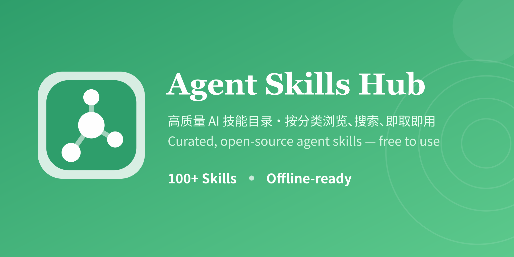

# Agent Skills Hub



[](CHANGELOG.md) [](LICENSE) [](README.md) [](prototype/prototype.html)

A centrally managed collection of AI skills covering Brand & Design, Docs & Content, Data Analysis & Visualization, Frontend Dev, Backend & Platform, Mobile Dev, WordPress & CMS, Engineering Practice & Quality, File & Format Handling, Automation & Integration, AI & Agents, Media & Multimedia, and Security — 189 skill packs on GitHub (1 marked hidden, 188 publicly visible). Each skill is a standalone directory with `SKILL.md` plus optional `scripts/`, `references/`, `assets/`, `agents/`; localized with Chinese categories and descriptions, while bodies keep upstream English (coverage tracked by `tools/coverage.py`).

## Quick Start

> Just want to use a skill? 5 steps, no build scripts needed.

1. **Browse skills**: open [`prototype/prototype.html`](prototype/prototype.html) directly (offline, self-contained) or run the `app/` web app.
2. **Pick a skill**: filter by the 13 domains; open a card to read its `SKILL.md` and trigger conditions.
3. **Install**: copy the whole `skills/<name>/` directory into your agent's skills path:
   - **Claude Code**: `~/.claude/skills/` (Windows: `%USERPROFILE%\.claude\skills\`)
   - **CodeBuddy**: your agent's skills path (see client docs)
4. **Trigger**: skills auto-trigger via the `description` in `SKILL.md`, or invoke explicitly with `@skill-name`.
5. **Check dependencies**: some skills need `scripts/` or external tools — read the skill's `SKILL.md` first.

> For bulk install / update / uninstall, see [Usage](#usage) below.

## Highlights

> Why choose Agent Skills Hub?

| | Highlight | Description |
|---|---|---|
| ⚙️ | **Zero-maintenance listing** | Skill data and the showcase page are auto-generated from on-disk `skills/*/SKILL.md` by `npm run build` — no manual listing to maintain when adding or removing skills |
| 🗂️ | **189 skills · 13 domains** | Covers Brand & Design, Docs & Content, Data Analysis & Visualization, Frontend Dev, Backend & Platform, Mobile Dev, WordPress & CMS, Engineering Practice & Quality, File & Format Handling, Automation & Integration, AI & Agents, Media & Multimedia, Security |
| 🌏 | **Chinese by default** | Chinese category (`category`) + English category (`en_category`) + one-line summary + full Chinese description (`description`, default display language), English original in `en_description` — ready for Chinese-speaking agent users |
| 📦 | **One-click install** | Bulk install / update / remove via [skills-manager](https://github.com/xingkongliang/skills-manager) |
| 🚀 | **Works offline** | Self-contained static showcase (`prototype/prototype.html`) inlines all data — double-click to browse every skill with no framework dependency |

## Table of Contents

- [Repository Structure](#repository-structure)
- [Browsing Skills](#browsing-skills)
- [Usage](#usage)
- [Online Showcase](#online-showcase)
- [Contributing](#contributing)
- [License](#license)
- [Related Documents](#related-documents)

## Repository Structure

```
<skill-name>/
├── SKILL.md          # entry: frontmatter (name/description/en_description/zh_displayName/category/en_category) + notes
├── scripts/          # optional: executables
├── references/       # optional: reference docs
├── assets/           # optional: templates/assets
└── agents/           # optional: sub-agent definitions
```

## Browsing Skills

Skills are organized into the following domains (see the [Online Showcase](#online-showcase) for the full, live list; this table is a navigation aid and does not churn with every skill add/remove):

| Domain | Skills |
|--------|--------|
| Brand & Design | 38 |
| Docs & Content | 2 |
| Data Analysis & Visualization | 2 |
| Frontend Dev | 25 |
| Backend & Platform | 10 |
| Mobile Dev | 13 |
| WordPress & CMS | 11 |
| Engineering Practice & Quality | 33 |
| File & Format Handling | 4 |
| Automation & Integration | 15 |
| AI & Agents | 8 |
| Media & Multimedia | 25 |
| Security | 4 |

> Browse all skills:
> - Static showcase: [`prototype/prototype.html`](prototype/prototype.html)
> - Data files: [`data/skills-data.json`](data/skills-data.json) (stable metadata, auto-generated from `skills/` via `npm run build`) + [`data/skills-metrics.json`](data/skills-metrics.json) (frequently-updated derived metrics, stored separately)
> - Web app: see [Online Showcase](#online-showcase) below

## Usage

Browse the skills first in the [Online Showcase](#online-showcase) (or open [`prototype/prototype.html`](prototype/prototype.html) directly), pick what you need, then install into your agent via either approach below.

### Option A: Manual copy (quick start)

1. Copy the whole `skills/<name>/` directory into your agent's skills path:
   - **Claude Code**: `~/.claude/skills/` (Windows: `%USERPROFILE%\.claude\skills\`)
   - **CodeBuddy**: your agent's skills path (see client docs)
   - Other agents: refer to their skill-directory convention
2. Skills auto-trigger via the `description` field in `SKILL.md`, or can be invoked explicitly with `@skill-name`.
3. Some skills depend on `scripts/` or external tools — read the skill's `SKILL.md` before use.

### Option B: Install & manage with skills-manager

We recommend [skills-manager](https://github.com/xingkongliang/skills-manager) for batch install/update/uninstall of skills, avoiding manual directory copying:

```bash
git clone https://github.com/sutchan/Agent-Skills-Hub.git
cd Agent-Skills-Hub
# import/link skills from skills/ into your agent via skills-manager
# example (use commands actually supported by skills-manager):
#   skills-manager add ./skills/<name>   # install a single skill
#   skills-manager sync ./skills         # bulk-sync all skills
```

See the [skills-manager docs](https://github.com/xingkongliang/skills-manager) for commands and configuration.

## Online Showcase

The repo provides two showcase options, both auto-generated from `skills/<name>/SKILL.md` — run `npm run build` after adding/removing skills, no manual list maintenance needed:

| Directory | Type | Purpose |
|-----------|------|---------|
| `prototype/prototype.html` | Static single-file showcase | Self-contained skill data inlined at build time; opens offline |
| `app/` | Runnable web app (source) | Next.js app generating data from `skills/` |

`app/` is the web app source workspace (Next.js App Router lives under the repo-root `app/` directory); tech stack and commands per the repo-root `package.json`:

```bash
npm install
npm run dev      # local dev server (next dev)
npm run build    # production build (data/prototype + next build)
npm run start    # start production server
```

## Contributing

- New skills: use the [`skill-creator`](skills/skill-creator/) skill to create and evaluate per guidelines.
- Name skill directories in `kebab-case`, e.g. `python-testing/`.
- `SKILL.md` must include `name`, `description`, `en_description`, `zh_displayName`, `category`, and `en_category` front-matter; `category` is one of the 13 domains (Chinese stable key: 品牌与设计 / 文档与内容 / 数据分析与可视化 / 前端开发 / 后端与平台 / 移动端开发 / WordPress 与 CMS / 工程实践与质量 / 文件与格式处理 / 自动化与集成 / AI 与智能体 / 音视频与多媒体 / 安全), `en_category` is the corresponding English category name, `zh_displayName` is a one-line Chinese summary, `description` is the Chinese full description (default display language), `en_description` is the English original, and `tools/build-skills-data.mjs` reads these fields from the on-disk `skills/` as the single source of truth (unknown categories are appended as a trailing "其他/Other" category, which is a violation and must be zero).
- After skill changes, run `npm run build` to regenerate `data/skills-data.json` + `data/skills-metrics.json` and the showcase. Frequently-updated metrics (popularity/stars/size/files) only need `skills-metrics.json` recomputed while the main data file stays lightweight.

See also [CONTRIBUTING.md](.github/CONTRIBUTING.md).

## License

Per-skill licenses are in each directory's `LICENSE` file (e.g. [skill-creator/LICENSE.txt](skill-creator/LICENSE.txt)).

## Related Documents

- [Changelog](CHANGELOG.md) — version & change history
- [Contributing](.github/CONTRIBUTING.md) — how to add/update skills
- [Code of Conduct](.github/CODE_OF_CONDUCT.md) — community standards
- [Security Policy](.github/SECURITY.md) — private vulnerability reporting and security red lines
- [Support](.github/SUPPORT.md) — where to get help, FAQ and contact channels
- [License](LICENSE) — project license (MIT)
- [中文文档](README.md) — Chinese README
- Repository: https://github.com/sutchan/Agent-Skills-Hub
