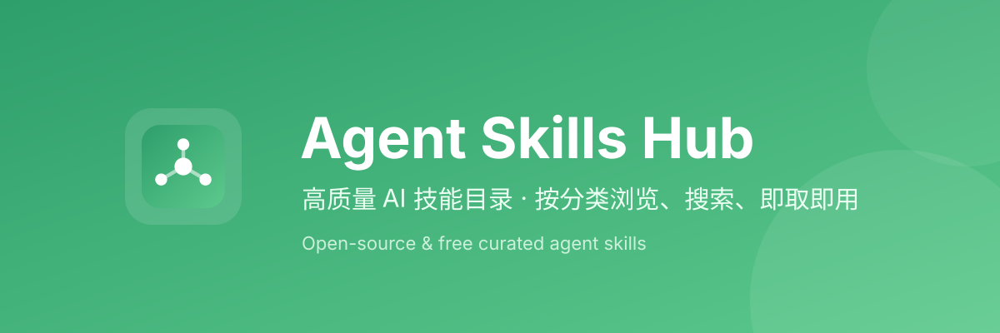

# Agent Skills Hub



[](README.en.md) [](CHANGELOG.md) [](LICENSE) [](README.md)

> Author: Sut Chan
>
> Repository: https://github.com/sutchan/Agent-Skills-Hub
>
> A centrally managed collection of AI skills, containing 173 skill packs for development, design, testing, DevOps, agent engineering, and industry domains.

Each skill is a standalone directory containing `SKILL.md` (name + description metadata + usage notes) plus optional `scripts/`, `references/`, `assets/`, `agents/`.

> Note: This repo localizes skills with Chinese categories and Chinese descriptions. Skills whose body is already English keep their English `SKILL.md`; a few Chinese-only skills keep Chinese descriptions here. Translation coverage is tracked by `tools/coverage.py` in CI.

## Table of Contents

- [Repository Structure](#repository-structure)
- [Skill Categories](#skill-categories)
- [Usage](#usage)
- [Contributing](#contributing)
- [License](#license)
- [Related Documents](#related-documents)

## Repository Structure

```
<skill-name>/
├── SKILL.md          # entry: name + description metadata + notes
├── scripts/          # optional: executables
├── references/       # optional: reference docs
├── assets/           # optional: templates/assets
└── agents/           # optional: sub-agent definitions
```

## Skill Categories

### Frontend & UI Design (13)

- **[api-design](skills/api-design/)** — REST API design patterns including resource naming, status codes, pagination, filtering, error responses, versioning, and rate limiting for production APIs.
- **[brand-voice](skills/brand-voice/)** — Build a source-derived writing style profile from real posts, essays, launch notes, docs, or site copy, then reuse that profile across content, outreach, and social workflows. Use when the user wants voice consistency…
- **[design-system](skills/design-system/)** — Use this skill to generate or audit design systems, check visual consistency, and review PRs that touch styling.
- **[figma](skills/figma/)** — Use the Figma MCP server to fetch design context, screenshots, variables, and assets from Figma, and to translate Figma nodes into production code. Trigger when a task involves Figma URLs, node IDs, design-to-code imp…
- **[frontend-design](skills/frontend-design/)** — Guidance for distinctive, intentional visual design when building new UI or reshaping an existing one. Helps with aesthetic direction, typography, and making choices that don't read as templated defaults.
- **[frontend-patterns](skills/frontend-patterns/)** — Frontend development patterns for React, Next.js, state management, performance optimization, and UI best practices.
- **[frontend-skill](skills/frontend-skill/)** — Use when the task asks for a visually strong landing page, website, app, prototype, demo, or game UI. This skill enforces restrained composition, image-led hierarchy, cohesive content structure, and tasteful motion wh…
- **[frontend-slides](skills/frontend-slides/)** — Create stunning, animation-rich HTML presentations from scratch or by converting PowerPoint files. Use when the user wants to build a presentation, convert a PPT/PPTX to web, or create slides for a talk/pitch. Helps n…
- **[liquid-glass-design](skills/liquid-glass-design/)** — iOS 26 Liquid Glass design system — dynamic glass material with blur, reflection, and interactive morphing for SwiftUI, UIKit, and WidgetKit.
- **[shadcn](skills/shadcn/)** — Manages shadcn components and projects — adding, searching, fixing, debugging, styling, and composing UI. Provides project context, component docs, and usage examples. Applies when working with shadcn/ui, component re…
- **[theme-factory](skills/theme-factory/)** — Toolkit for styling artifacts with a theme. These artifacts can be slides, docs, reportings, HTML landing pages, etc. There are 10 pre-set themes with colors/fonts that you can apply to any artifact that has been crea…
- **[ui-demo](skills/ui-demo/)** — Record polished UI demo videos using Playwright. Use when the user asks to create a demo, walkthrough, screen recording, or tutorial video of a web application. Produces WebM videos with visible cursor, natural pacing…
- **[web-design-guidelines](skills/web-design-guidelines/)** — Review UI code for Web Interface Guidelines compliance. Use when asked to "review my UI", "check accessibility", "audit design", "review UX", or "check my site against best practices".

### Backend, Languages & Frameworks (40)

- **[bun-runtime](skills/bun-runtime/)** — Bun as runtime, package manager, bundler, and test runner. When to choose Bun vs Node, migration notes, and Vercel support.
- **[cpp-coding-standards](skills/cpp-coding-standards/)** — C++ coding standards based on the C++ Core Guidelines (isocpp.github.io). Use when writing, reviewing, or refactoring C++ code to enforce modern, safe, and idiomatic practices.
- **[dart-flutter-patterns](skills/dart-flutter-patterns/)** — Production-ready Dart and Flutter patterns covering null safety, immutable state, async composition, widget architecture, popular state management frameworks (BLoC, Riverpod, Provider), GoRouter navigation, Dio networ…
- **[django-patterns](skills/django-patterns/)** — Django architecture patterns, REST API design with DRF, ORM best practices, caching, signals, middleware, and production-grade Django apps.
- **[django-security](skills/django-security/)** — Django security best practices, authentication, authorization, CSRF protection, SQL injection prevention, XSS prevention, and secure deployment configurations.
- **[django-tdd](skills/django-tdd/)** — Django testing strategies with pytest-django, TDD methodology, factory_boy, mocking, coverage, and testing Django REST Framework APIs.
- **[django-verification](skills/django-verification/)** — Verification loop for Django projects: migrations, linting, tests with coverage, security scans, and deployment readiness checks before release or PR.
- **[dotnet-patterns](skills/dotnet-patterns/)** — Idiomatic C# and .NET patterns, conventions, dependency injection, async/await, and best practices for building robust, maintainable .NET applications.
- **[golang-patterns](skills/golang-patterns/)** — Idiomatic Go patterns, best practices, and conventions for building robust, efficient, and maintainable Go applications.
- **[golang-testing](skills/golang-testing/)** — Go testing patterns including table-driven tests, subtests, benchmarks, fuzzing, and test coverage. Follows TDD methodology with idiomatic Go practices.
- **[java-coding-standards](skills/java-coding-standards/)** — Java coding standards for Spring Boot services: naming, immutability, Optional usage, streams, exceptions, generics, and project layout.
- **[jpa-patterns](skills/jpa-patterns/)** — JPA/Hibernate patterns for entity design, relationships, query optimization, transactions, auditing, indexing, pagination, and pooling in Spring Boot.
- **[kotlin-coroutines-flows](skills/kotlin-coroutines-flows/)** — Kotlin Coroutines and Flow patterns for Android and KMP — structured concurrency, Flow operators, StateFlow, error handling, and testing.
- **[kotlin-exposed-patterns](skills/kotlin-exposed-patterns/)** — JetBrains Exposed ORM patterns including DSL queries, DAO pattern, transactions, HikariCP connection pooling, Flyway migrations, and repository pattern.
- **[kotlin-ktor-patterns](skills/kotlin-ktor-patterns/)** — Ktor server patterns including routing DSL, plugins, authentication, Koin DI, kotlinx.serialization, WebSockets, and testApplication testing.
- **[kotlin-patterns](skills/kotlin-patterns/)** — Idiomatic Kotlin patterns, best practices, and conventions for building robust, efficient, and maintainable Kotlin applications with coroutines, null safety, and DSL builders.
- **[kotlin-testing](skills/kotlin-testing/)** — Kotlin testing patterns with Kotest, MockK, coroutine testing, property-based testing, and Kover coverage. Follows TDD methodology with idiomatic Kotlin practices.
- **[laravel-patterns](skills/laravel-patterns/)** — Laravel architecture patterns, routing/controllers, Eloquent ORM, service layers, queues, events, caching, and API resources for production apps.
- **[laravel-plugin-discovery](skills/laravel-plugin-discovery/)** — Discover and evaluate Laravel packages via LaraPlugins.io MCP. Use when the user wants to find plugins, check package health, or assess Laravel/PHP compatibility.
- **[laravel-security](skills/laravel-security/)** — Laravel security best practices for authn/authz, validation, CSRF, mass assignment, file uploads, secrets, rate limiting, and secure deployment.
- **[laravel-tdd](skills/laravel-tdd/)** — Test-driven development for Laravel with PHPUnit and Pest, factories, database testing, fakes, and coverage targets.
- **[laravel-verification](skills/laravel-verification/)** — Verification loop for Laravel projects: env checks, linting, static analysis, tests with coverage, security scans, and deployment readiness.
- **[nestjs-patterns](skills/nestjs-patterns/)** — NestJS architecture patterns for modules, controllers, providers, DTO validation, guards, interceptors, config, and production-grade TypeScript backends.
- **[nextjs-turbopack](skills/nextjs-turbopack/)** — Next.js 16+ and Turbopack — incremental bundling, FS caching, dev speed, and when to use Turbopack vs webpack.
- **[nuxt4-patterns](skills/nuxt4-patterns/)** — Nuxt 4 app patterns for hydration safety, performance, route rules, lazy loading, and SSR-safe data fetching with useFetch and useAsyncData.
- **[perl-patterns](skills/perl-patterns/)** — Modern Perl 5.36+ idioms, best practices, and conventions for building robust, maintainable Perl applications.
- **[perl-security](skills/perl-security/)** — Comprehensive Perl security covering taint mode, input validation, safe process execution, DBI parameterized queries, web security (XSS/SQLi/CSRF), and perlcritic security policies.
- **[perl-testing](skills/perl-testing/)** — Perl testing patterns using Test2::V0, Test::More, prove runner, mocking, coverage with Devel::Cover, and TDD methodology.
- **[postgres-patterns](skills/postgres-patterns/)** — PostgreSQL database patterns for query optimization, schema design, indexing, and security. Based on Supabase best practices.
- **[python-patterns](skills/python-patterns/)** — Pythonic idioms, PEP 8 standards, type hints, and best practices for building robust, efficient, and maintainable Python applications.
- **[rust-patterns](skills/rust-patterns/)** — Idiomatic Rust patterns, ownership, error handling, traits, concurrency, and best practices for building safe, performant applications.
- **[rust-testing](skills/rust-testing/)** — Rust testing patterns including unit tests, integration tests, async testing, property-based testing, mocking, and coverage. Follows TDD methodology.
- **[springboot-patterns](skills/springboot-patterns/)** — Spring Boot architecture patterns, REST API design, layered services, data access, caching, async processing, and logging. Use for Java Spring Boot backend work.
- **[springboot-security](skills/springboot-security/)** — Spring Security best practices for authn/authz, validation, CSRF, secrets, headers, rate limiting, and dependency security in Java Spring Boot services.
- **[springboot-tdd](skills/springboot-tdd/)** — Test-driven development for Spring Boot using JUnit 5, Mockito, MockMvc, Testcontainers, and JaCoCo. Use when adding features, fixing bugs, or refactoring.
- **[springboot-verification](skills/springboot-verification/)** — Verification loop for Spring Boot projects: build, static analysis, tests with coverage, security scans, and diff review before release or PR.
- **[swift-actor-persistence](skills/swift-actor-persistence/)** — Thread-safe data persistence in Swift using actors — in-memory cache with file-backed storage, eliminating data races by design.
- **[swift-concurrency-6-2](skills/swift-concurrency-6-2/)** — Swift 6.2 Approachable Concurrency — single-threaded by default, @concurrent for explicit background offloading, isolated conformances for main actor types.
- **[swift-protocol-di-testing](skills/swift-protocol-di-testing/)** — Protocol-based dependency injection for testable Swift code — mock file system, network, and external APIs using focused protocols and Swift Testing.
- **[swiftui-patterns](skills/swiftui-patterns/)** — SwiftUI architecture patterns, state management with @Observable, view composition, navigation, performance optimization, and modern iOS/macOS UI best practices.

### Architecture & Design (4)

- **[android-clean-architecture](skills/android-clean-architecture/)** — Clean Architecture patterns for Android and Kotlin Multiplatform projects — module structure, dependency rules, UseCases, Repositories, and data layer patterns.
- **[architecture-decision-records](skills/architecture-decision-records/)** — Capture architectural decisions made during Claude Code sessions as structured ADRs. Auto-detects decision moments, records context, alternatives considered, and rationale. Maintains an ADR log so future developers un…
- **[backend-patterns](skills/backend-patterns/)** — Backend architecture patterns, API design, database optimization, and server-side best practices for Node.js, Express, and Next.js API routes.
- **[hexagonal-architecture](skills/hexagonal-architecture/)** — Design, implement, and refactor Ports & Adapters systems with clear domain boundaries, dependency inversion, and testable use-case orchestration across TypeScript, Java, Kotlin, and Go services.

### Testing & Quality (18)

- **[browser-qa](skills/browser-qa/)** — Use this skill to automate visual testing and UI interaction verification using browser automation after deploying features.
- **[code-quality-check](skills/code-quality-check/)** — Run code quality checks including linting, type checking, and code formatting. Use when you want to ensure code follows project standards.
- **[code-reviewer](skills/code-reviewer/)** — 对指定文件夹内的代码进行全面审查，包含规范性检查、Bug检测、性能优化建议、可读性评估和基于华为Java编程规范的质量评分；当用户需要审查代码质量、发现潜在问题、评估代码规范符合度或生成代码审查报告时使用
- **[code-stats](skills/code-stats/)** — Generate code statistics and analysis reports. Use when you want to understand the codebase structure and metrics.
- **[coding-standards](skills/coding-standards/)** — Universal coding standards, best practices, and patterns for TypeScript, JavaScript, React, and Node.js development.
- **[e2e-testing](skills/e2e-testing/)** — Playwright E2E testing patterns, Page Object Model, configuration, CI/CD integration, artifact management, and flaky test strategies.
- **[flutter-dart-code-review](skills/flutter-dart-code-review/)** — Library-agnostic Flutter/Dart code review checklist covering widget best practices, state management patterns (BLoC, Riverpod, Provider, GetX, MobX, Signals), Dart idioms, performance, accessibility, security, and cle…
- **[plankton-code-quality](skills/plankton-code-quality/)** — Write-time code quality enforcement using Plankton — auto-formatting, linting, and Claude-powered fixes on every file edit via hooks.
- **[python-testing](skills/python-testing/)** — Python testing strategies using pytest, TDD methodology, fixtures, mocking, parametrization, and coverage requirements.
- **[quality-nonconformance](skills/quality-nonconformance/)** — Codified expertise for quality control, non-conformance investigation, root cause analysis, corrective action, and supplier quality management in regulated manufacturing. Informed by quality engineers with 15+ years e…
- **[run-tests](skills/run-tests/)** — Run the project's test suite including unit tests, component tests, and end-to-end tests. Use when you want to verify code functionality.
- **[safety-guard](skills/safety-guard/)** — Use this skill to prevent destructive operations when working on production systems or running agents autonomously.
- **[security-best-practices](skills/security-best-practices/)** — Perform language and framework specific security best-practice reviews and suggest improvements. Trigger only when the user explicitly requests security best practices guidance, a security review/report, or secure-by-…
- **[security-review](skills/security-review/)** — Use this skill when adding authentication, handling user input, working with secrets, creating API endpoints, or implementing payment/sensitive features. Provides comprehensive security checklist and patterns.
- **[security-scan](skills/security-scan/)** — Scan your Claude Code configuration (.claude/ directory) for security vulnerabilities, misconfigurations, and injection risks using AgentShield. Checks CLAUDE.md, settings.json, MCP servers, hooks, and agent definitions.
- **[skill-comply](skills/skill-comply/)** — Visualize whether skills, rules, and agent definitions are actually followed — auto-generates scenarios at 3 prompt strictness levels, runs agents, classifies behavioral sequences, and reports compliance rates with fu…
- **[tdd-workflow](skills/tdd-workflow/)** — Use this skill when writing new features, fixing bugs, or refactoring code. Enforces test-driven development with 80%+ coverage including unit, integration, and E2E tests.
- **[verification-loop](skills/verification-loop/)** — A comprehensive verification system for Claude Code sessions.

### Agent & AI Engineering (11)

- **[agent-browser](skills/agent-browser/)** — Browser automation CLI for AI agents. Use when the user needs to interact with websites, including navigating pages, filling forms, clicking buttons, taking screenshots, extracting data, testing web apps, or automatin…
- **[autonomous-agent-harness](skills/autonomous-agent-harness/)** — Transform Claude Code into a fully autonomous agent system with persistent memory, scheduled operations, computer use, and task queuing. Replaces standalone agent frameworks (Hermes, AutoGPT) by leveraging Claude Code…
- **[benchmark](skills/benchmark/)** — Use this skill to measure performance baselines, detect regressions before/after PRs, and compare stack alternatives.
- **[cost-aware-llm-pipeline](skills/cost-aware-llm-pipeline/)** — Cost optimization patterns for LLM API usage — model routing by task complexity, budget tracking, retry logic, and prompt caching.
- **[data-scraper-agent](skills/data-scraper-agent/)** — Build a fully automated AI-powered data collection agent for any public source — job boards, prices, news, GitHub, sports, anything. Scrapes on a schedule, enriches data with a free LLM (Gemini Flash), stores results…
- **[deep-research](skills/deep-research/)** — Multi-source deep research using firecrawl and exa MCPs. Searches the web, synthesizes findings, and delivers cited reports with source attribution. Use when the user wants thorough research on any topic with evidence…
- **[enterprise-agent-ops](skills/enterprise-agent-ops/)** — Operate long-lived agent workloads with observability, security boundaries, and lifecycle management.
- **[eval-harness](skills/eval-harness/)** — Formal evaluation framework for Claude Code sessions implementing eval-driven development (EDD) principles
- **[foundation-models-on-device](skills/foundation-models-on-device/)** — Apple FoundationModels framework for on-device LLM — text generation, guided generation with @Generable, tool calling, and snapshot streaming in iOS 26+.
- **[healthcare-eval-harness](skills/healthcare-eval-harness/)** — Patient safety evaluation harness for healthcare application deployments. Automated test suites for CDSS accuracy, PHI exposure, clinical workflow integrity, and integration compliance. Blocks deployments on safety fa…
- **[prompt-optimizer](skills/prompt-optimizer/)** — Analyze raw prompts, identify intent and gaps, match ECC components (skills/commands/agents/hooks), and output a ready-to-paste optimized prompt. Advisory role only — never executes the task itself. TRIGGER when: user…

### DevOps & Infrastructure (8)

- **[build-deploy](skills/build-deploy/)** — Build and deploy the project to different environments. Use when you want to prepare the project for deployment.
- **[claude-devfleet](skills/claude-devfleet/)** — Orchestrate multi-agent coding tasks via Claude DevFleet — plan projects, dispatch parallel agents in isolated worktrees, monitor progress, and read structured reports.
- **[database-migrations](skills/database-migrations/)** — Database migration best practices for schema changes, data migrations, rollbacks, and zero-downtime deployments across PostgreSQL, MySQL, and common ORMs (Prisma, Drizzle, Kysely, Django, TypeORM, golang-migrate).
- **[deployment-patterns](skills/deployment-patterns/)** — Deployment workflows, CI/CD pipeline patterns, Docker containerization, health checks, rollback strategies, and production readiness checklists for web applications.
- **[docker-patterns](skills/docker-patterns/)** — Docker and Docker Compose patterns for local development, container security, networking, volume strategies, and multi-service orchestration.
- **[gh-cli](skills/gh-cli/)** — GitHub CLI (gh) comprehensive reference for repositories, issues, pull requests, Actions, projects, releases, gists, codespaces, organizations, extensions, and all GitHub operations from the command line.
- **[git-commit](skills/git-commit/)** — Execute git commit with conventional commit message analysis, intelligent staging, and message generation. Use when user asks to commit changes, create a git commit, or mentions "/commit". Supports: (1) Auto-detecting…
- **[git-workflow](skills/git-workflow/)** — Git workflow patterns including branching strategies, commit conventions, merge vs rebase, conflict resolution, and collaborative development best practices for teams of all sizes.

### Data & Machine Learning (8)

- **[clickhouse-io](skills/clickhouse-io/)** — ClickHouse database patterns, query optimization, analytics, and data engineering best practices for high-performance analytical workloads.
- **[defuddle](skills/defuddle/)** — Extract clean markdown content from web pages using Defuddle CLI, removing clutter and navigation to save tokens. Use instead of WebFetch when the user provides a URL to read or analyze, for online documentation, arti…
- **[exa-search](skills/exa-search/)** — Neural search via Exa MCP for web, code, and company research. Use when the user needs web search, code examples, company intel, people lookup, or AI-powered deep research with Exa's neural search engine.
- **[gan-style-harness](skills/gan-style-harness/)** — GAN-inspired Generator-Evaluator agent harness for building high-quality applications autonomously. Based on Anthropic's March 2026 harness design paper.
- **[iterative-retrieval](skills/iterative-retrieval/)** — Pattern for progressively refining context retrieval to solve the subagent context problem
- **[pytorch-patterns](skills/pytorch-patterns/)** — PyTorch deep learning patterns and best practices for building robust, efficient, and reproducible training pipelines, model architectures, and data loading.
- **[regex-vs-llm-structured-text](skills/regex-vs-llm-structured-text/)** — Decision framework for choosing between regex and LLM when parsing structured text — start with regex, add LLM only for low-confidence edge cases.
- **[social-graph-ranker](skills/social-graph-ranker/)** — Weighted social-graph ranking for warm intro discovery, bridge scoring, and network gap analysis across X and LinkedIn. Use when the user wants the reusable graph-ranking engine itself, not the broader outreach or net…

### Content, Docs & Writing (10)

- **[article-writing](skills/article-writing/)** — Write articles, guides, blog posts, tutorials, newsletter issues, and other long-form content in a distinctive voice derived from supplied examples or brand guidance. Use when the user wants polished written content l…
- **[doc-coauthoring](skills/doc-coauthoring/)** — Guide users through a structured workflow for co-authoring documentation. Use when user wants to write documentation, proposals, technical specs, decision docs, or similar structured content. This workflow helps users…
- **[documentation-lookup](skills/documentation-lookup/)** — Use up-to-date library and framework docs via Context7 MCP instead of training data. Activates for setup questions, API references, code examples, or when the user names a framework (e.g. React, Next.js, Prisma).
- **[investor-materials](skills/investor-materials/)** — Create and update pitch decks, one-pagers, investor memos, accelerator applications, financial models, and fundraising materials. Use when the user needs investor-facing documents, projections, use-of-funds tables, mi…
- **[investor-outreach](skills/investor-outreach/)** — Draft cold emails, warm intro blurbs, follow-ups, update emails, and investor communications for fundraising. Use when the user wants outreach to angels, VCs, strategic investors, or accelerators and needs concise, pe…
- **[market-research](skills/market-research/)** — Conduct market research, competitive analysis, investor due diligence, and industry intelligence with source attribution and decision-oriented summaries. Use when the user wants market sizing, competitor comparisons,…
- **[product-lens](skills/product-lens/)** — Use this skill to validate the "why" before building, run product diagnostics, and convert vague ideas into specs.
- **[santa-method](skills/santa-method/)** — Multi-agent adversarial verification with convergence loop. Two independent review agents must both pass before output ships.
- **[team-builder](skills/team-builder/)** — Interactive agent picker for composing and dispatching parallel teams
- **[writing-plans](skills/writing-plans/)** — Use when you have a spec or requirements for a multi-step task, before touching code

### Video & Media (6)

- **[fal-ai-media](skills/fal-ai-media/)** — Unified media generation via fal.ai MCP — image, video, and audio. Covers text-to-image (Nano Banana), text/image-to-video (Seedance, Kling, Veo 3), text-to-speech (CSM-1B), and video-to-audio (ThinkSound). Use when t…
- **[manim-video](skills/manim-video/)** — Build reusable Manim explainers for technical concepts, graphs, system diagrams, and product walkthroughs, then hand off to the wider ECC video stack if needed. Use when the user wants a clean animated explainer rathe…
- **[remotion-video-creation](skills/remotion-video-creation/)** — Best practices for Remotion - Video creation in React. 29 domain-specific rules covering 3D, animations, audio, captions, charts, transitions, and more.
- **[video-editing](skills/video-editing/)** — AI-assisted video editing workflows for cutting, structuring, and augmenting real footage. Covers the full pipeline from raw capture through FFmpeg, Remotion, ElevenLabs, fal.ai, and final polish in Descript or CapCut…
- **[video-use](skills/video-use/)** — Edit any video by conversation. Transcribe, cut, color grade, generate overlay animations, burn subtitles — for talking heads, montages, tutorials, travel, interviews. No presets, no menus. Ask questions, confirm the…
- **[videodb](skills/videodb/)** — See, Understand, Act on video and audio. See- ingest from local files, URLs, RTSP/live feeds, or live record desktop; return realtime context and playable stream links. Understand- extract frames, build visual/semanti…

### Industry Domains (13)

- **[carrier-relationship-management](skills/carrier-relationship-management/)** — Codified expertise for managing carrier portfolios, negotiating freight rates, tracking carrier performance, allocating freight, and maintaining strategic carrier relationships. Informed by transportation managers wit…
- **[customer-billing-ops](skills/customer-billing-ops/)** — Operate customer billing workflows such as subscriptions, refunds, churn triage, billing-portal recovery, and plan analysis using connected billing tools like Stripe. Use when the user needs to help a customer, inspec…
- **[energy-procurement](skills/energy-procurement/)** — Codified expertise for electricity and gas procurement, tariff optimization, demand charge management, renewable PPA evaluation, and multi-facility energy cost management. Informed by energy procurement managers with…
- **[google-workspace-ops](skills/google-workspace-ops/)** — Operate across Google Drive, Docs, Sheets, and Slides as one workflow surface for plans, trackers, decks, and shared documents. Use when the user needs to find, summarize, edit, migrate, or clean up Google Workspace a…
- **[healthcare-cdss-patterns](skills/healthcare-cdss-patterns/)** — Clinical Decision Support System (CDSS) development patterns. Drug interaction checking, dose validation, clinical scoring (NEWS2, qSOFA), alert severity classification, and integration into EMR workflows.
- **[healthcare-emr-patterns](skills/healthcare-emr-patterns/)** — EMR/EHR development patterns for healthcare applications. Clinical safety, encounter workflows, prescription generation, clinical decision support integration, and accessibility-first UI for medical data entry.
- **[healthcare-phi-compliance](skills/healthcare-phi-compliance/)** — Protected Health Information (PHI) and Personally Identifiable Information (PII) compliance patterns for healthcare applications. Covers data classification, access control, audit trails, encryption, and common leak v…
- **[inventory-demand-planning](skills/inventory-demand-planning/)** — Codified expertise for demand forecasting, safety stock optimization, replenishment planning, and promotional lift estimation at multi-location retailers. Informed by demand planners with 15+ years experience managing…
- **[lead-intelligence](skills/lead-intelligence/)** — AI-native lead intelligence and outreach pipeline. Replaces Apollo, Clay, and ZoomInfo with agent-powered signal scoring, mutual ranking, warm path discovery, source-derived voice modeling, and channel-specific outrea…
- **[logistics-exception-management](skills/logistics-exception-management/)** — Codified expertise for handling freight exceptions, shipment delays, damages, losses, and carrier disputes. Informed by logistics professionals with 15+ years operational experience. Includes escalation protocols, car…
- **[production-scheduling](skills/production-scheduling/)** — Codified expertise for production scheduling, job sequencing, line balancing, changeover optimization, and bottleneck resolution in discrete and batch manufacturing. Informed by production schedulers with 15+ years ex…
- **[returns-reverse-logistics](skills/returns-reverse-logistics/)** — Codified expertise for returns authorization, receipt and inspection, disposition decisions, refund processing, fraud detection, and warranty claims management. Informed by returns operations managers with 15+ years e…
- **[visa-doc-translate](skills/visa-doc-translate/)** — Translate visa application documents (images) to English and create a bilingual PDF with original and translation

### Productivity & Tools (20)

- **[ck](skills/ck/)** — Persistent per-project memory for Claude Code. Auto-loads project context on session start, tracks sessions with git activity, and writes to native memory. Commands run deterministic Node.js scripts — behavior is cons…
- **[click-path-audit](skills/click-path-audit/)** — Trace every user-facing button/touchpoint through its full state change sequence to find bugs where functions individually work but cancel each other out, produce wrong final state, or leave the UI in an inconsistent…
- **[dmux-workflows](skills/dmux-workflows/)** — Multi-agent orchestration using dmux (tmux pane manager for AI agents). Patterns for parallel agent workflows across Claude Code, Codex, OpenCode, and other harnesses. Use when running multiple agent sessions in paral…
- **[file-deduplicator](skills/file-deduplicator/)** — 扫描项目目录，基于内容哈希找出重复文件，并检测空文件/无效文件，安全（默认 dry-run）地清理冗余。Use when the user wants to find/remove duplicate, redundant, or invalid files in a project.
- **[find-orphans](skills/find-orphans/)** — Finds orphaned files, unused components, and dead code in projects. Use when 清理代码, 查找孤儿文件, 删除无用代码, cleanup, find unused, or removing legacy code.
- **[iga-pages](skills/iga-pages/)** — Deploy frontend and full-stack projects to IGA Pages. Use when the user mentions IGA Pages or requests deployment ("deploy my app", "publish this site", "push this live", "deploy and give me the link", "create a previ…
- **[mcp-builder](skills/mcp-builder/)** — Guide for creating high-quality MCP (Model Context Protocol) servers that enable LLMs to interact with external services through well-designed tools. Use when building MCP servers to integrate external APIs or service…
- **[mcp-server-patterns](skills/mcp-server-patterns/)** — Build MCP servers with Node/TypeScript SDK — tools, resources, prompts, Zod validation, stdio vs Streamable HTTP. Use Context7 or official MCP docs for latest API.
- **[nanoclaw-repl](skills/nanoclaw-repl/)** — Operate and extend NanoClaw v2, ECC's zero-dependency session-aware REPL built on claude -p.
- **[obsidian-bases](skills/obsidian-bases/)** — Create and edit Obsidian Bases (.base files) with views, filters, formulas, and summaries. Use when working with .base files, creating database-like views of notes, or when the user mentions Bases, table views, card v…
- **[obsidian-cli](skills/obsidian-cli/)** — Interact with Obsidian vaults using the Obsidian CLI to read, create, search, and manage notes, tasks, properties, and more. Also supports plugin and theme development with commands to reload plugins, run JavaScript,…
- **[obsidian-markdown](skills/obsidian-markdown/)** — Create and edit Obsidian Flavored Markdown with wikilinks, embeds, callouts, properties, and other Obsidian-specific syntax. Use when working with .md files in Obsidian, or when the user mentions wikilinks, callouts,…
- **[openclaw-persona-forge](skills/openclaw-persona-forge/)** — 为 OpenClaw AI Agent 锻造完整的龙虾灵魂方案。根据用户偏好或随机抽卡， 输出身份定位、灵魂描述(SOUL.md)、角色化底线规则、名字和头像生图提示词。 如当前环境提供已审核的生图 skill，可自动生成统一风格头像图片。 当用户需要创建、设计或定制 OpenClaw 龙虾灵魂时使用。 不适用于：微调已有 SOUL.md、非 OpenClaw 平台的角色设计、纯工具型无性格 Agent。 触发词：龙虾灵魂、虾魂、…
- **[opensource-pipeline](skills/opensource-pipeline/)** — Open-source pipeline: fork, sanitize, and package private projects for safe public release. Chains 3 agents (forker, sanitizer, packager). Triggers: '/opensource', 'open source this', 'make this public', 'prepare for…
- **[ralphinho-rfc-pipeline](skills/ralphinho-rfc-pipeline/)** — RFC-driven multi-agent DAG execution pattern with quality gates, merge queues, and work unit orchestration.
- **[repo-scan](skills/repo-scan/)** — Cross-stack source code asset audit — classifies every file, detects embedded third-party libraries, and delivers actionable four-level verdicts per module with interactive HTML reports.
- **[skill-creator](skills/skill-creator/)** — Create new skills, modify and improve existing skills, and measure skill performance. Use when users want to create a skill from scratch, edit, or optimize an existing skill, run evals to test a skill, benchmark skill…
- **[skill-stocktake](skills/skill-stocktake/)** — Use when auditing Claude skills and commands for quality. Supports Quick Scan (changed skills only) and Full Stocktake modes with sequential subagent batch evaluation.
- **[web-artifacts-builder](skills/web-artifacts-builder/)** — Suite of tools for creating elaborate, multi-component claude.ai HTML artifacts using modern frontend web technologies (React, Tailwind CSS, shadcn/ui). Use for complex artifacts requiring state management, routing, o…
- **[workspace-surface-audit](skills/workspace-surface-audit/)** — Audit the active repo, MCP servers, plugins, connectors, env surfaces, and harness setup, then recommend the highest-value ECC-native skills, hooks, agents, and operator workflows. Use when the user wants help setting…

### Context & Prompt Engineering (13)

- **[blueprint](skills/blueprint/)** — Turn a one-line objective into a step-by-step construction plan for multi-session, multi-agent engineering projects. Each step has a self-contained context brief so a fresh agent can execute it cold. Includes adversar…
- **[dogfood](skills/dogfood/)** — Systematically explore and test a web application to find bugs, UX issues, and other problems. Use when asked to "dogfood", "QA", "exploratory test", "find issues", "bug hunt", "test this app/site/platform", or review…
- **[executing-plans](skills/executing-plans/)** — Use when you have a written implementation plan to execute in a separate session with review checkpoints
- **[openspec-apply-change](skills/openspec-apply-change/)** — Implement tasks from an OpenSpec change. Use when the user wants to start implementing, continue implementation, or work through tasks.
- **[openspec-archive-change](skills/openspec-archive-change/)** — Archive a completed change in the experimental workflow. Use when the user wants to finalize and archive a change after implementation is complete.
- **[openspec-explore](skills/openspec-explore/)** — Enter explore mode - a thinking partner for exploring ideas, investigating problems, and clarifying requirements. Use when the user wants to think through something before or during a change.
- **[openspec-propose](skills/openspec-propose/)** — Propose a new change with all artifacts generated in one step. Use when the user wants to quickly describe what they want to build and get a complete proposal with design, specs, and tasks ready for implementation.
- **[performance-analysis](skills/performance-analysis/)** — Analyze project performance including bundle size and load times. Use when you want to optimize performance.
- **[rules-distill](skills/rules-distill/)** — Scan skills to extract cross-cutting principles and distill them into rules — append, revise, or create new rule files
- **[search-first](skills/search-first/)** — Research-before-coding workflow. Search for existing tools, libraries, and patterns before writing custom code. Invokes the researcher agent.
- **[strategic-compact](skills/strategic-compact/)** — Suggests manual context compaction at logical intervals to preserve context through task phases rather than arbitrary auto-compaction.
- **[structured-context-compressor](skills/structured-context-compressor/)** — Compress a long agent conversation into a nine-part continuation summary that preserves request, files, errors, user messages, current work, and the next aligned step.
- **[token-budget-advisor](skills/token-budget-advisor/)** — Offers the user an informed choice about how much response depth to consume before answering. Use this skill when the user explicitly wants to control response length, depth, or token budget. TRIGGER when: "token budg…

### Other (9)

- **[claude-api](skills/claude-api/)** — Anthropic Claude API patterns for Python and TypeScript. Covers Messages API, streaming, tool use, vision, extended thinking, batches, prompt caching, and Claude Agent SDK. Use when building applications with the Clau…
- **[dependency-management](skills/dependency-management/)** — Manage project dependencies including checking for updates and security vulnerabilities. Use when you want to ensure dependencies are up-to-date and secure.
- **[jira-integration](skills/jira-integration/)** — Use this skill when retrieving Jira tickets, analyzing requirements, updating ticket status, adding comments, or transitioning issues. Provides Jira API patterns via MCP or direct REST calls.
- **[nutrient-document-processing](skills/nutrient-document-processing/)** — Process, convert, OCR, extract, redact, sign, and fill documents using the Nutrient DWS API. Works with PDFs, DOCX, XLSX, PPTX, HTML, and images.
- **[project-flow-ops](skills/project-flow-ops/)** — Operate execution flow across GitHub and Linear by triaging issues and pull requests, linking active work, and keeping GitHub public-facing while Linear remains the internal execution layer. Use when the user wants ba…
- **[project-guidelines-example](skills/project-guidelines-example/)** — Example project-specific skill template based on a real production application.
- **[vercel-react-best-practices](skills/vercel-react-best-practices/)** — React and Next.js performance optimization guidelines from Vercel Engineering. This skill should be used when writing, reviewing, or refactoring React/Next.js code to ensure optimal performance patterns. Triggers on t…
- **[vercel-react-native-skills](skills/vercel-react-native-skills/)** — React Native and Expo best practices for building performant mobile apps. Use
- **[x-api](skills/x-api/)** — X/Twitter API integration for posting tweets, threads, reading timelines, search, and analytics. Covers OAuth auth patterns, rate limits, and platform-native content posting. Use when the user wants to interact with X…

## Usage

1. Copy the needed skill directory into your agent's skills path (e.g. Claude Code / CodeBuddy `skills/`).
2. Skills are auto-triggered via the `description` field in `SKILL.md`, or invoked explicitly with `@skill-name`.
3. Some skills depend on scripts or external tools — read the skill's `SKILL.md` before use.

### Install & manage with skills-manager

We recommend [skills-manager](https://github.com/xingkongliang/skills-manager) for batch install/update/uninstall of skills, avoiding manual directory copying.

```bash
git clone https://github.com/sutchan/Agent-Skills-Hub.git
# import/link skills from skills/ into your agent via skills-manager
```

See the [skills-manager docs](https://github.com/xingkongliang/skills-manager) for commands and configuration.

### Online showcase

The repo provides a runnable web app for browsing all skills:

| Directory | Type | Purpose |
|-----------|------|---------|
| `app/` | Runnable web app (**source**) | The project's web app source workspace, generating data from `skills/<name>/SKILL.md` at build time (see [`app/README.md`](app/README.md)) |

#### App (app/)

`app/` is the runnable web app source workspace, for actual development, iteration and build (tech stack per [`app/README.md`](app/README.md)).

```bash
cd app
npm install
npm run dev      # local dev server
npm run build    # production build
npm run start    # start production server
```

The app uses `skills/<name>/SKILL.md` as the authoritative data source, generating skill data at build time (see [`app/README.md`](app/README.md)).

### Brand Assets

The project uses a unified vector logo and favicon in brand green `#2e9e6b` (HSL `152 56% 40%`), sharing the same hue as the design system `--primary` (light mode brightens to `#5cc98c` / `146 52% 60%`). All assets are SVG and scale infinitely. The brand glyph (three nodes converging to a hub) has a single source of truth in [`brand/hub.svg`](brand/hub.svg) as `<symbol id="ash-hub">` (driven by `currentColor`); all marks live in the [`app/public/`](app/public/) directory (served by Next.js as `/logo.svg`, `/favicon.svg`, etc.) and inline the same symbol so the shape stays in one place; `app/icon.svg` is the Next.js deploy icon, generated from `app/public/favicon.svg`.

| Asset | File | Description |
|-------|------|-------------|
| Color logo | [`app/public/logo.svg`](app/public/logo.svg) | Rounded-square tile with three nodes converging to a hub; for headers and covers |
| Monochrome logo | [`app/public/logo-monochrome.svg`](app/public/logo-monochrome.svg) | Dark-green tile (`#10231a`) with brand-green glyph; for light footers / print |
| Favicon | [`app/public/favicon.svg`](app/public/favicon.svg) | Solid green, no gradient; for browser tabs and bookmarks |
| README banner | [`app/public/banner.svg`](app/public/banner.svg) | 1200×400 brand-green gradient + serif title/subtitle, hero under the title |
| Social share banner | [`app/public/banner-og.svg`](app/public/banner-og.svg) | 1200×628 (1.91:1) Open Graph / social card, text-safe |
| App icon | [`app/icon.svg`](app/icon.svg) | Auto-detected by Next.js as favicon / apple-touch (from `app/public/favicon.svg`) |

### Finding a skill

List all skills:

```bash
ls skills/
```

Search skills by keyword (e.g. "test"):

```bash
grep -rl "test" skills/*/SKILL.md
```

## Contributing

See [CONTRIBUTING.md](.github/CONTRIBUTING.md) for how to add or update skills, and keep `README.md` / `README.en.md` in sync.

## License

Per-skill licenses are in each directory's `LICENSE` file (e.g. [skill-creator/LICENSE.txt](skill-creator/LICENSE.txt)).

## Related Documents

- [Changelog](CHANGELOG.md) — version & change history
- [Contributing](.github/CONTRIBUTING.md) — how to add/update skills
- [Code of Conduct](.github/CODE_OF_CONDUCT.md) — community standards (Contributor Covenant)
- [Security Policy](.github/SECURITY.md) — private vulnerability reporting and security red lines
- [Support](.github/SUPPORT.md) — where to get help, FAQ and contact channels
- [License](LICENSE) — project license (MIT)
- [中文文档](README.md) — Chinese README
- [Workspace](agent-skills-hub.code-workspace) — workspace config
- Repository: https://github.com/sutchan/Agent-Skills-Hub
